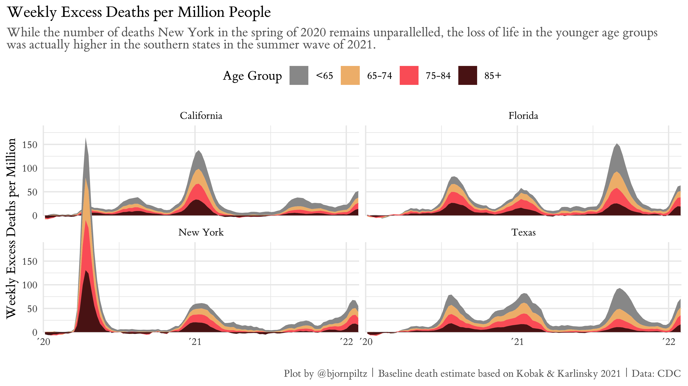
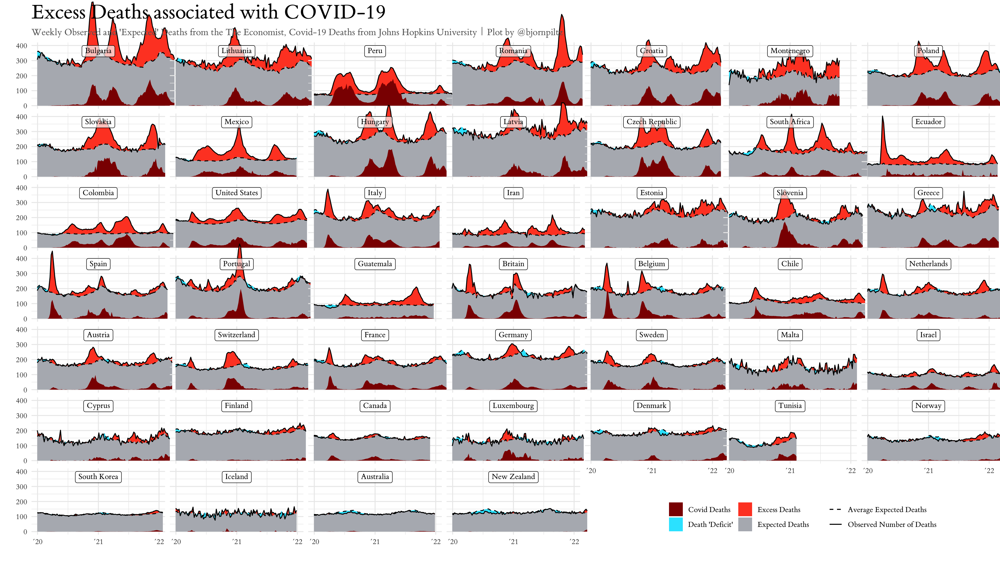
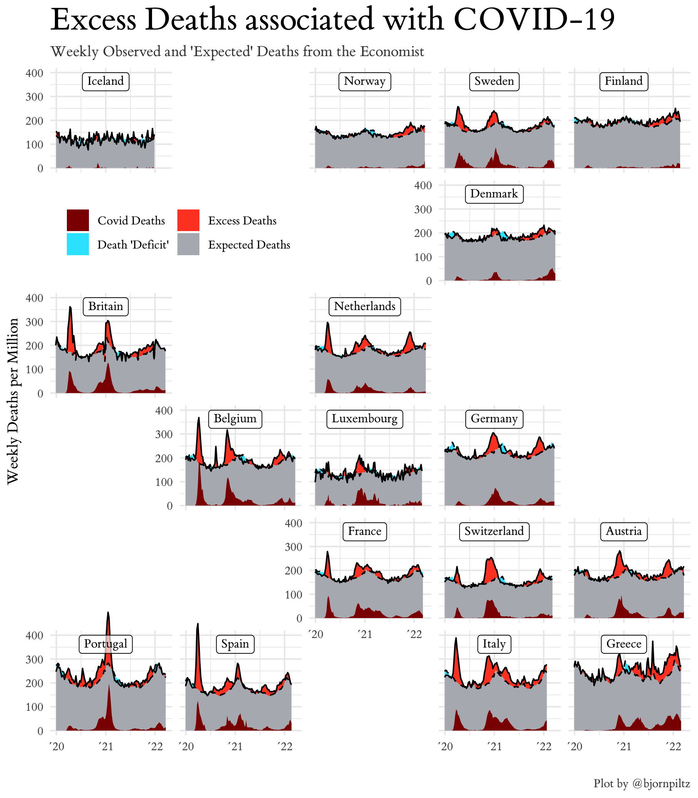

# Excess Deaths associated with COVID-19
This repository attempts to collect and visualize different data sources for *Excess Deaths* -- the difference between deaths of all causes in a region and an estimate of *Expected Deaths*.  

## CDCs estimates of Excess Deaths for the US
[Excess Deaths Associated with COVID-19](https://www.cdc.gov/nchs/nvss/vsrr/covid19/excess_deaths.htm)

By State

and the whole nation

### By Age group
Unfortunately the CDC doesn't provide estimates of expected deaths by age groups. We have used the method of [Kobak and Karlinsky, 2021](https://github.com/dkobak/excess-mortality/) to calculate an estimate in order to calculate excess deaths by age group.

## Comparing select states

The notebook <a href="us_state_comparison.ipynb">us_state_comparison.ipynb</a> shows how the data set can be used to compare mortality of different states.

## Kobak & Karlinsky
We borrow our baseline *Expeced Deaths* calculation from [Kobak & Karlinsky](https://github.com/dkobak/excess-mortality) using an age dependent linear extrapolation of the 2015–19 trend.  

Here is a visualization of their data as Excess Deaths per Million people. 

The same data as a proportion of Expected Deaths.

## The Economist
The Economist has their own [tracker of Excess deaths](https://www.economist.com/graphic-detail/coronavirus-excess-deaths-tracker) with a disparate collection of countries.

Here is a comparison of Excess Deaths in Western and Eastern Europe.

|

   |

   |
|---|---|
